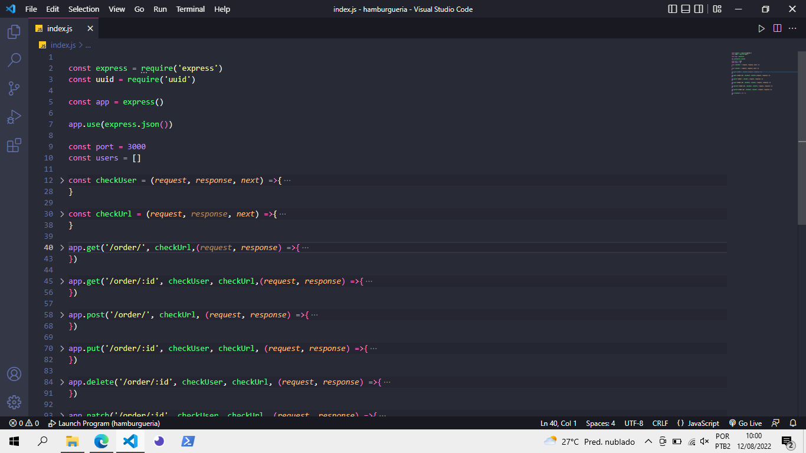
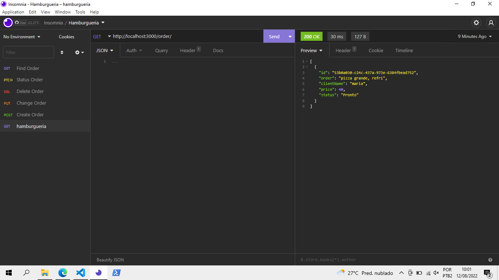

#Projeto Hamburgueria - back-end

> Resultado do Projeto Hamburgueria

### Sobre:

O projeto é uma aplicação back-end usando javascript, node, express

- [x] EXPRESS
- [X] NODE
- [X] JAVASCRIPT
- [X] INSOMNIA

## 🤝 Colaboradores

Agradecemos às seguintes pessoas que contribuíram para este projeto:

<table>
  <tr>
    <td aling="center">
      <a href="#">
         
        
          <b>Vagner Santos</b>
        
      </a>
    </td>
  </tr>
</table>

